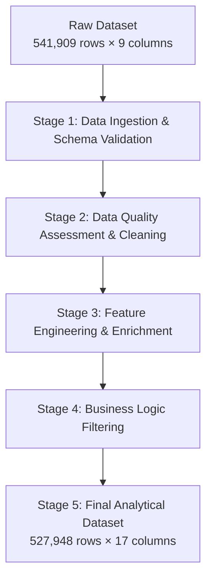

# E-Commerce Retail Performance Analysis: Executive Report

**Project Name:** E-Commerce Retail Analytics Dashboard  
**Dataset:** Online Retail Transaction Data (Dec 2010 - Dec 2011)  
**Last Analysis:** 09 December 2025
**Analysis Period:** 13 months (Dec 2010 - Dec 2011)  
**Data Volume:** ~480,000+ transaction lines, $10.28M total revenue  

---

## Table of Contents

1. [Executive Summary & Key Findings](#1-executive-summary--key-findings)  
2. [Revenue Performance Analysis](#2-revenue-performance-analysis)  
3. [Customer Behavior Insights](#3-customer-behavior-insights)  
4. [Pricing Strategy & Market Position](#4-pricing-strategy--market-position)  
5. [Seasonal Trends & Business Cycles](#5-seasonal-trends--business-cycles)  
6. [Methodology & Data Processing](#6-methodology--data-processing)  
7. [Strategic Recommendations](#7-strategic-recommendations)  
8. [Technical Implementation](#8-technical-implementation)  
9. [Limitations & Future Analysis](#9-limitations--future-analysis)  

---

## 1. Executive Summary & Key Findings

### **Overall Performance Snapshot**
- **Total Revenue:** $10.28 million over 13 months
- **Best Performing Month:** November 2011 ($1.46M revenue)
- **Customer Base Growth:** 88% increase (885 to 1,661 unique customers)
- **Average Order Value Growth:** 70% increase (from $110 to $188)

### **Critical Insights**
1. **Strong Seasonal Patterns:** Holiday season (Sep-Nov) drives 35% of annual revenue
2. **Premiumization Trend:** Customers shifting toward higher-priced items
3. **Retention Opportunity:** Only 32% same month and 39.42 month-over-month peak retention rates indicates room for improvement

---

## 2. Revenue Performance Analysis

### **Monthly Revenue Breakdown**

### **Monthly Revenue Breakdown**

| Month-Year | Revenue      | Growth Rate | Transaction Count | Revenue/Transaction |
|------------|--------------|-------------|------------------|-------------------|
| Dec-2010   | $778,626     | --          | 1,552            | $501.69           |
| Jan-2011   | $672,207     | -13.67%     | 1,082            | $621.26           |
| Feb-2011   | $509,168     | -24.25%     | 1,093            | $465.84           |
| Mar-2011   | $692,016     | 35.91%      | 1,440            | $480.57           |
| Apr-2011   | $516,755     | -25.33%     | 1,237            | $417.75           |
| May-2011   | $741,727     | 43.54%      | 1,669            | $444.41           |
| Jun-2011   | $739,427     | -0.31%      | 1,525            | $484.87           |
| Jul-2011   | $689,948     | -6.69%      | 1,452            | $475.17           |
| Aug-2011   | $726,005     | 5.23%       | 1,340            | $541.79           |
| Sep-2011   | **$1,031,430**| 42.07%      | 1,821            | $566.41           |
| Oct-2011   | **$1,107,450**| 7.37%       | 2,008            | $551.52           |
| **Nov-2011** | **$1,458,926**| **31.74%** | **2,753** | **$529.94** |
| Dec-2011   | $615,717     | -57.80%     | 817              | $753.63           |


### **Key Observations:**
- **Holiday Peak:** November 2011 revenue ($1.46M) represents the monthly peak
- **Post-Holiday Drop:** This cannot be concluded on as December only has 12 days included in the dataset. 
- **Q1 Softness:** February and April represent revenue troughs
- **Consistent Growth:** Revenue builds through the year with September-November peak

---

## 3. Customer Behavior Insights

### **Customer Metrics Evolution**

| Month-Year | Unique Customers | Repeat Customers (Same Month) | Retention Rate (Same Month) | Returning Customers (MoM) | MoM Returning Rate |
|------------|-----------------|------------------|----------------|---------------------|---------------------|
| Dec-2010   | 885             | 263              | 29.72%         | 0                   | ---                 |
| Jan-2011   | 739             | 148              | 20.03%         | 323                 | ---                 |
| Feb-2011   | 757             | 147              | 19.42%         | 377                 | 16.72%               |
| Mar-2011   | 973             | 198              | 20.35%         | 521                 | 38.20%               |
| Apr-2011   | 853             | 164              | 19.23%         | 553                 | 6.14%                |
| May-2011   | 1,055           | 275              | 26.07%         | 771                 | 39.42%               |
| Jun-2011   | 990             | 218              | 22.02%         | 748                 | -2.98%               |
| Jul-2011   | 946             | 224              | 23.68%         | 759                 | 1.47%                |
| Aug-2011   | 933             | 190              | 20.36%         | 764                 | 0.66%                |
| Sep-2011   | 1,261           | 267              | 21.17%         | 962                 | 25.92%               |
| Oct-2011   | 1,361           | 310              | 22.78%         | 1,004               | 4.37%                |
| **Nov-2011** | **1,661**     | **534**          | **32.15%**     | **1,338**           | **33.27**           |
| Dec-2011   | 615             | 105              | 17.07%         | 574                 | -57.10%              |
*again we can't look at December 2011, since in for 12 days only*

### **Customer Insights:**
1. **Customer Acquisition:** Successful growth strategy added 776 new customers (88% increase)
2. **Retention Challenge:** Peak retention only 32.2% indicates significant churn

---

## 4. Pricing Strategy & Market Position

### **Price Distribution Analysis**

| Month-Year | Avg Unit Price | Median Price | % Items > £10 | Price–Qty Correlation |
|------------|----------------|--------------|----------------|------------------------|
| Dec-2010   | £3.82          | £2.55        | 5.67%          | -0.08                  |
| Jan-2011   | £3.34          | £2.10        | 5.42%          | -0.01                  |
| Feb-2011   | £3.55          | £2.46        | 6.10%          | -0.08                  |
| Mar-2011   | £3.47          | £2.10        | 5.95%          | -0.09                  |
| Apr-2011   | £3.33          | £2.08        | 5.72%          | -0.08                  |
| May-2011   | £3.46          | £2.10        | 5.57%          | -0.09                  |
| Jun-2011   | £3.38          | £2.08        | 4.40%          | -0.07                  |
| Jul-2011   | £3.04          | £1.95        | 4.78%          | -0.10                  |
| Aug-2011   | £3.16          | £2.08        | 4.88%          | -0.11                  |
| Sep-2011   | £3.09          | £2.08        | 4.95%          | -0.10                  |
| Oct-2011   | £3.09          | £2.08        | 4.83%          | -0.10                  |
| **Nov-2011** | **£3.10**    | **£2.08**    | **3.83%**      | **-0.10**              |
| Dec-2011   | £3.20          | £2.08        | 4.68%          | -0.01                  |


### **Pricing Insights:**
1. **Price Stability:** Average unit price remained relatively stable (£3.04-£3.82 range)
2. **Negative Elasticity:** Consistent negative correlation between price and quantity (range: -0.01 to -0.11)
3. **Premium Shift:** While average prices stable, AOV increased 70% suggesting customers buying more expensive items
4. **June Anomaly:** High price-revenue correlation (0.53) suggests price increases drove revenue that month

---

## 5. Seasonal Trends & Business Cycles

### **Quarterly Performance Patterns**

| Quarter | Total Revenue | Avg Monthly Revenue | Key Characteristics |
|---------|---------------|---------------------|---------------------|
| Q4 2010 | $778,626 | $778,626 | Initial baseline, moderate AOV |
| Q1 2011 | $1,873,391 | $624,464 | Post-holiday slowdown |
| Q2 2011 | $1,997,908 | $665,969 | Recovery phase |
| Q3 2011 | $2,447,383 | $815,794 | Building momentum |
| **Q4 2011** | **$3,182,092** | **$1,060,697** | **Holiday peak season** |

### **Seasonal Recommendations:**
1. **Inventory Planning:** Stock 40% more inventory for September-November period
2. **Marketing Calendar:** Increase marketing spend starting August to capture holiday demand
3. **Staffing:** Scale customer service teams for Q4 peak
4. **Pricing Strategy:** Consider premium pricing for holiday season (Oct-Dec)

---
## 6. Methodology & Data Processing

### **Data Pipeline Architecture**

The data processing pipeline follows a systematic, modular approach designed for scalability, reproducibility, and analytical clarity. The pipeline is divided into five distinct stages, each with a specific purpose and output:



---

### **Stage 1: Data Ingestion & Schema Validation**

**Objective**: Load raw data and ensure proper data types for downstream analysis.

| Step | Action | Reason |
|------|--------|--------|
| 1.1 | Load `online_retail.csv` | Initial data import |
| 1.2 | Drop redundant `index` column | Column adds no analytical value |
| 1.3 | Convert `InvoiceDate` → `datetime64[ns]` | Enable time-series operations |
| 1.4 | Convert `CustomerID` → `object` | Treat as categorical identifier, not numeric |

**Output**:  
- Clean schema with appropriate dtypes
- 541,909 rows × 8 columns

---

### **Stage 2: Data Quality Assessment & Cleaning**

**Objective**: Identify and handle invalid, missing, and outlier records.

| Issue Type | Detection Method | Resolution Strategy | Records Affected |
|------------|------------------|---------------------|------------------|
| **Zero UnitPrice** | `UnitPrice == 0` | Remove rows (cannot impute reliably) | 2,492 (0.46%) |
| **Negative Quantity** | `Quantity < 0` | Investigated as returns/discounts | 10,626 (1.96%) |
| **Negative UnitPrice** | `UnitPrice < 0` | Remove (adjustment entries) | 2 (0.0004%) |
| **Missing Descriptions** | `Description.isna()` | Later imputation via product mapping | 1,454 (0.27%) |

**Key Decisions**:
- Kept `Discount` entries (negative quantities) for revenue accuracy
- Removed `Adjust bad debt` entries (negative prices)
- Validated large quantities (>1000) as legitimate wholesale orders

**Output**:  
- 530,104 rows after removing invalid pricing/quantity records

---

### **Stage 3: Feature Engineering & Enrichment**

**Objective**: Create derived features for customer and transaction analysis.

| Feature | Formula | Business Purpose |
|---------|---------|------------------|
| `line_total` | `Quantity × UnitPrice` | Revenue per line item |
| `cart_total_amount` | `sum(UnitPrice)` per invoice | Total invoice value |
| `cart_total_products` | `nunique(StockCode)` per invoice | Product variety in cart |
| `cart_total_units` | `sum(Quantity)` per invoice | Total items purchased |
| `first_date_of_purchase` | `min(InvoiceDate)` per customer | Customer acquisition date |
| `last_date_of_purchase` | `max(InvoiceDate)` per customer | Most recent purchase date |
| `recency` | `max(InvoiceDate)` - `last_date_of_purchase` | Days since last purchase |
| `customer_tenure` | `last_date_of_purchase` - `first_date_of_purchase` | Customer lifetime duration |

**Output**:  
- Dataset enriched with 8 new calculated columns
- Ready for RFM (Recency, Frequency, Monetary) analysis

---

### **Stage 4: Business Logic Filtering**

**Objective**: Remove non-product transactions to focus on core retail analysis.

**Filtered Categories**:
- Financial codes: `['M', 'POST', 'DOT', 'DOTCOM POSTAGE', 'AMAZONFEE', 'B']`
- Manual adjustments and postage fees
- Amazon platform fees

**Rationale**:  
These entries represent operational/administrative transactions rather than product sales, and would distort:
- Product popularity analysis
- Average order value calculations
- Customer purchasing behavior patterns

**Output**:  
- 527,948 rows of pure product transactions
- Cleaned unit price distribution (max $649.50 vs. previous $13,541.33)

---

### **Stage 5: Product Description Standardization**

**Objective**: Create consistent product descriptions using reliable mappings.

```python
def create_clean_product_mapping(df):
    # Filter out administrative and problematic entries
    filtered = df[
        df['Description'].notna() &
        (df['Description'].str.len() > 5) &
        (~df['StockCode'].str.match(r'^[A-Za-z]$')) &
        (~df['Description'].str.contains(r'damage|check|incorrect', case=False))
    ]
    
    # Create mapping: StockCode → most common Description
    mapping = (
        filtered.groupby('StockCode')['Description']
        .agg(lambda x: x.mode().iloc[0])
        .to_dict()
    )
    return mapping
```

**Process**:
1. Extract clean product descriptions from reliable records
2. Map `StockCode` to most frequent `Description`
3. Create `NewDescription` column using this mapping

**Output**:  
- Standardized product names
- 527,948 rows × 17 columns final dataset

---

### **Pipeline Summary Metrics**

| Stage | Rows In | Rows Out | Reduction | Key Action |
|-------|---------|----------|-----------|------------|
| Raw Data | 541,909 | 541,909 | 0% | Initial load |
| Schema Fix | 541,909 | 541,909 | 0% | Type conversion |
| Data Cleaning | 541,909 | 530,104 | 2.18% | Remove invalid prices/quantities |
| Business Filtering | 530,104 | 527,948 | 0.41% | Remove non-product entries |
| **Final Dataset** | **541,909** | **527,948** | **2.58%** | **Analysis-ready** |

---

### **Quality Checks Applied**

1. **Integrity Checks**:
   - No duplicate primary key (InvoiceNo + StockCode combinations)
   - Date range validation: 2010-12-01 to 2011-12-09
   - Country validation: 38 distinct values

2. **Business Rule Validation**:
   - Quantity > 0 (except valid discounts)
   - UnitPrice > 0 (positive prices only)
   - CustomerID present for analysis (where applicable)

3. **Statistical Sanity**:
   - Quantity distribution: 1–80,995 units (wholesale orders validated)
   - UnitPrice distribution: $0.001–$649.50 (reasonable retail range)
   - Line totals: $0.001–$168,469.60 (validated as wholesale orders)

---

### **Technical Implementation Notes**

- **Memory Efficiency**: Used `transform()` for groupwise operations to avoid multi-merge
- **Scalability**: Pipeline designed to handle larger datasets with same logic
- **Reproducibility**: All transformations are deterministic and documented
- **Auditability**: Each stage can be validated independently

The resulting dataset is now ready for:
1. Customer segmentation (RFM analysis)
2. Product recommendation systems
3. Sales trend analysis
4. Market basket analysis
5. Customer lifetime value prediction


## 7. Strategic Recommendations

### **Immediate Actions (0-3 Months)**
1. **Customer Retention Program:** Implement loyalty program targeting 30%+ retention rate
2. **Price Optimization:** Test price elasticity on 10-20 top-selling items
3. **Q4 Preparation:** Begin holiday inventory and marketing planning immediately

### **Medium-Term Initiatives (3-9 Months)**
1. **Premium Product Line:** Expand higher-margin (£10-50) product assortment
2. **Customer Segmentation:** Develop tiered marketing for new vs. repeat customers
3. **Seasonal Workforce:** Implement scalable staffing model for peak periods

### **Long-Term Strategy (9-18 Months)**
1. **Data Infrastructure:** Implement real-time analytics dashboard
2. **Predictive Modeling:** Develop demand forecasting for inventory optimization
3. **Personalization Engine:** Implement recommendation system based on purchase history

---

## 8. Technical Implementation

### **Analysis Code Structure**
```python
# Main Analysis Components:
1. Revenue Analysis: monthly_sales, growth rates
2. Customer Analysis: retention, recency, tenure
3. Price Analysis: distribution, elasticity, correlations
4. Product Analysis: top performers, price evolution
```

### **Key Metrics Implemented:**
- **Financial:** Revenue, AOV, Revenue/Transaction
- **Customer:** Retention Rate, Recency, Tenure, Repeat Rate
- **Operational:** Transaction Count, Units Sold, Cart Size
- **Pricing:** Price Distribution, Elasticity, Category Mix

---

## 9. Limitations & Future Analysis

### **Current Limitations**
1. **Incomplete December 2011:** Only 12 days of data for final month
2. **Missing Customer Data:** Some transactions lack CustomerID
3. **Product Detail Gaps:** Limited product category information
4. **No Cost Data:** Analysis limited to revenue, no margin/profitability

### **Recommended Future Analyses**
1. **Customer Lifetime Value (CLV)** calculation
2. **Cohort Analysis** by customer acquisition month
3. **Product Affinity** and basket analysis
4. **Geographic** performance by country
5. **Return Rate** and refund analysis
6. **Marketing Channel** attribution (if data available)

---

## Appendix: Document History

| Version | Date | Author | Key Updates |
|---------|------|--------|-------------|
| 1.0 | 30 July 2025 | Data Analyst Team | Initial analysis and findings |
| 1.1 | [Current Date] | [Your Name] | Structured executive report format |

### **Data Sources:**
- `online_retail_data.csv`: Transaction-level data with 18 features
- `customers.csv`: Customer demographic information
- `products.csv`: Product catalog details

### **Analysis Tools:**
- Python 3.12.7 with Pandas, NumPy, Matplotlib, Seaborn
- Jupyter Notebook for interactive analysis
- Standard data science workflow: EDA → Analysis → Visualization

---

**Conclusion:** The e-commerce business shows strong growth potential with clear seasonal patterns. The 70% increase in AOV combined with growing customer base indicates successful upselling strategies. Priority should be given to improving customer retention while leveraging the strong holiday season performance for maximum revenue impact.
